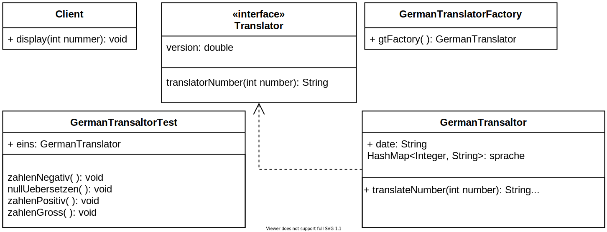

# 1.
## Objekt-Erzeugung
Die Objekt-Erzeugung kann nach dem Factory Method Pattern in einer anderern Klasse stattfinden. Die andere Klasse habe ich im controller verzeichnis abgelegt, sie könnte aber auch im model-Package liegen.
Die Factory Klasse erzeugt innerhalb einer statischen Methode eine Instanz der Klasse ``GermanTranslator`` und gibt diese direkt zurück.
```Java
return new GermanTranslator(); 
```
Danach kann die ``Client``-Klasse mit der Instanz arbeiten und die Instanzmethode der ``GermanTranslator``-Klasse aufrufen.
## Entwurfsmuster
Das verwendete Design Pattern heißt Factory Pattern.
|Vorteile|
|--------|
|Mehr Übersicht bei Objekterzeugung|
|Einheitliche Instanzen im ganzen Projekt|
|Lesbarer Code|
|Auslagerung von Erzeugungslogik in eigene Klasse|

## Anpassung für Kompilerfehler
Um die Instanz korrekt zu verwenden sollte im Client die `` GermanTranslator `` Instanz als `` Translator `` behandelt werden.
Dazu muss der Typ der Variable welche den Translator hält auf `` Translator `` gesetzt werden. Dies erreicht man indem man
```Java
Translator generalTranslator = TranslatorFactory.gtFactory(); 
```
schreibt. Dafür muss die Sichtbarkeit des Translator-Interfaces auf ``
public
`` gesetzt werden.

# 2
## Software-Implementierung
Die Implementierung der Softwarelösung befindet sich im GitHub repository [JohnMeyerhoff/SE01](https://github.com/JohnMeyerhoff/SE01).

## Klassendiagramm in UML


# 3
## Seperate Test-Klassen
Der Vorteil der Seperaten Test-Klassen ist, dass die Komponenten, welche getestet werden
zwangsläufig auf ihr Verhalten nach aussen getestet werden. Somit werden die Sichtbarkeiten
der Variablen und Methoden direkt mitgetestet. Mit Externen Tests testet man auf Korrektheit
des Programms, indem man Prüft ob gültige Eingaben ungültige Ausgaben erzeugen. Zielführend
ist es möglichst viele Arten von Fehlern mit den Testfellen abzudecken. Die Seperaten
Test-Klassen lassen sich für bessere Übersicht in einem Test-Verzeichnis zusammenfassen.

## Blackbox-Tests und Äquivalezklassen
Der sinn der Äquivalenzklassen bei Blackbox-Tests ist eine hohe
Testabdeckung zu erreichen indem man sicherstellt, dass alle unterschiedlichen Eingabemöglichkeiten bzw. Kategorien von eingaben in den Tests repräsentiert sind.

## JUnit auf Client
Mit JUnit kann man die ``System.out``-Ausgabe nicht abfangen und überprüfen. Die einzige Methode im Client ist ein void, der Rückgabewert kann also inhaltlich nicht wirklich überprüft werden.
Dadurch dass wir Zugriff auf den Quellcode der ``Client``-Klasse haben, können wir sehen, dass sie auf die Methode ``TranslateNumber()`` des ``Translator``-Interfaces zugreift. Es ist also sinnvoll, den Rückgabewert dieser Methode mit Unit-Tests zu testen.