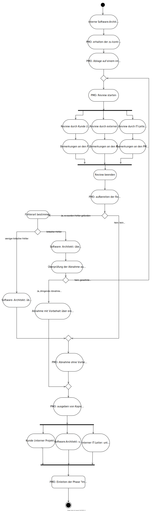

# Team-Kennzeichnung
Dieses Aufgabenblatt ist in Teamarbeit von Klara Golubovic und Johannes Meyerhoff bearbeitet worden.
# 1
## Aktivitätsdiagramm in UML

## Anmerkungen zum Diagramm

# 2
## Programmierung der ...

## Tests
Tabelle der Tests
| Test Case No. | Category (pos; neg) | Äquivalenzklassen        | input | output (erwartet)  |
|---------------|---------------------|--------------------------|-------|--------------------|
| 1             | pos                 | gÄK1: leere Liste        | m1    | OK / Size = 1      |
| 2             | pos                 | gÄK2: neues Element       | m2    | OK / Size = 2      |
| 3             | neg                 | gÄK3: bestehendes Element | m1    | NOT OK / Exception |
| 4            | neg                 | gÄK4: bestehendes Element nach Exception | m1    | NOT OK / Exception |

Äquivalenzklassen:
| Parameter | Äquivalenzklasse | Repräsentant |
| -- | --   | -- |
| m1 | gÄK1: leere Liste | ExampleMember1 -> Container1 |
| m2 | gÄK2: neues Element | ExampleMember2 -> Container1 |
| m2 | gÄK3: bestehendes Element | ExampleMember2 -> Container1 |
| m2 | gÄK4: bestehendes Element nach Exception | ExampleMember2 -> Container1 |

| Sonderfall Null | input | output |
| --| -- | --|
|Member-Referenz | null | ContainerException|